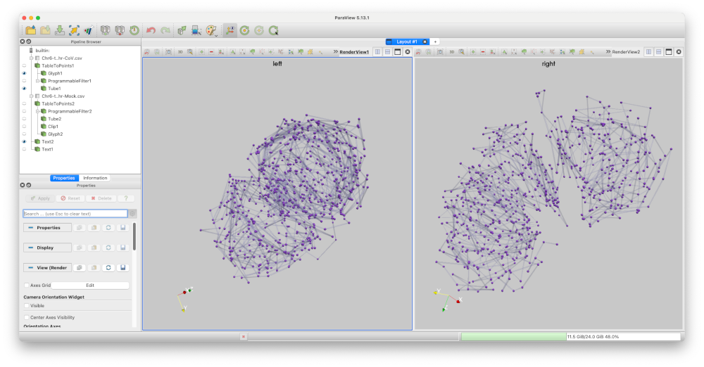

# EPIC compare application

A comparative viewer paraview state file for the epic project. When loaded into ParaView 5.13 or later,
the user can choose two properly defined epic structure files for comparative viewing.

||
| ---- |
|*Screen capture of the epic comparison script running in ParaView 5.13*| 

# How to use this application

The application requires two paraview `vtp` files, constructed according to the EPIC compare
specification.

- Install Paraview v5.13

- Create a local python environment with python 3.10:

```
    python3.10 -m venv myenv

    source ./myenv/bin/activate       

    pip install paraview-trame-components
```

- Run the local `compare.py` file with `pvpython` and the following arguments:

```
    /path/to/pvpython \
        --venv myenv \
        --force-offscreen-rendering \
        ./compare.py \
        --leftfile /path/to/file.vtp \
        --rightfile /path/to/file.vtp \ 
        --plugindir /path/to/paraview/plugins
```
