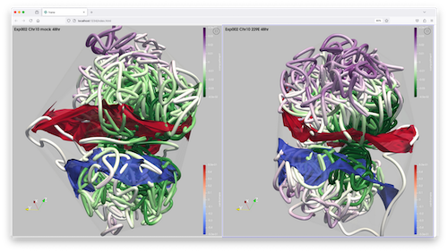

# EPIC compare application

A comparative viewer paraview state file for the epic project. When loaded into ParaView 5.13 or later,
the user can choose two properly defined epic structure files for comparative viewing.

||
| ---- |
|*Screen capture of the epic comparison script running in ParaView 5.13*| 

# How to use this application

The application requires two paraview `vtp` files, constructed according to the EPIC compare
specification.

- Install Paraview v5.13

- Create a local python environment with python 3.10:

```
    python3.10 -m venv myenv

    source ./myenv/bin/activate       

    pip install paraview-trame-components
```

- Run the local `compare.py` file with `pvpython` and the following arguments:

```
    /path/to/pvpython \
        --venv myenv \
        --force-offscreen-rendering \
        ./compare.py \
        --port 1234 \
        --esession file.yaml
```
Where an `esession` file is a yaml file with the following structure:
```
datasets:
  0:
    file: /path/to/some.vtp
    chromosome: chr10
    resolution: 100000
    time: 48
    label: 
      text: 'Chr 10 48hrs'
      fontsize: 24
      color: [0, 0, 0]
      bold: False
  1:
    file: /path/to/some.vtp
    chromosome: chr10
    resolution: 100000
    time: 48
    label: 
      text: 'Chr 10 48hrs' 
      fontsize: 24
      color: [0, 0, 0]
      bold: False
```
