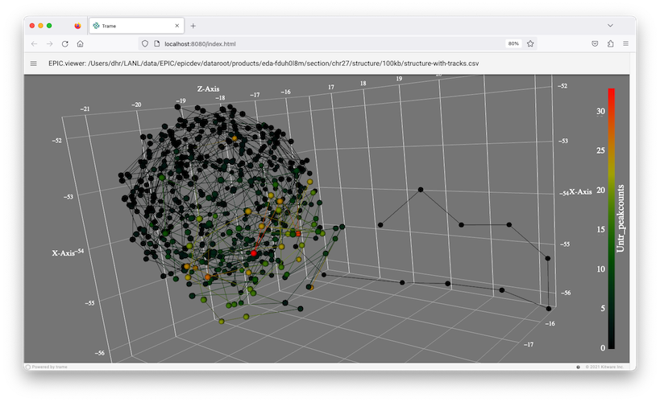

# epicview

A basic viewer for the epic project.

# Tools

### epic.viewer

||
| ---- |
|*Screen capture of the epic viewer application*| 

This is a viewer based on the *trame* application framework.

To set up an environment to run `epic.viewer.py` script:

```
# local installation of this module
python3.9 -m venv .venv
source ./.venv/bin/activate
python -m pip install --upgrade pip
pip install .
```

### examples

Run the application on a session file included in the repository:
```
epicview testing/session.yaml
```

Where a session file is the following:
```
epicview:
  version: 0.2.0

data:
  structure:  testing/hilbert/hilbert-2.csv
  variable:   increase
  resolution: 200000
```

To run the app on a file with an absolute path: 
```
epicview some/path/to/a/structure-with-tracks.csv
```

### file format for viewer

The viewer reads a csv file, expecting that there are columns named `id,x,y,z` that are the 
3D positions of each point in space. Additional columns defined track data for each point.

```
id,x,y,z
1.0,10.0,10.0,10.0
1.0,20.0,20.0,20.0
1.0,10.0,10.0,10.0
1.0,10.0,10.0,10.0
1.0,10.0,10.0,10.0
...
```
